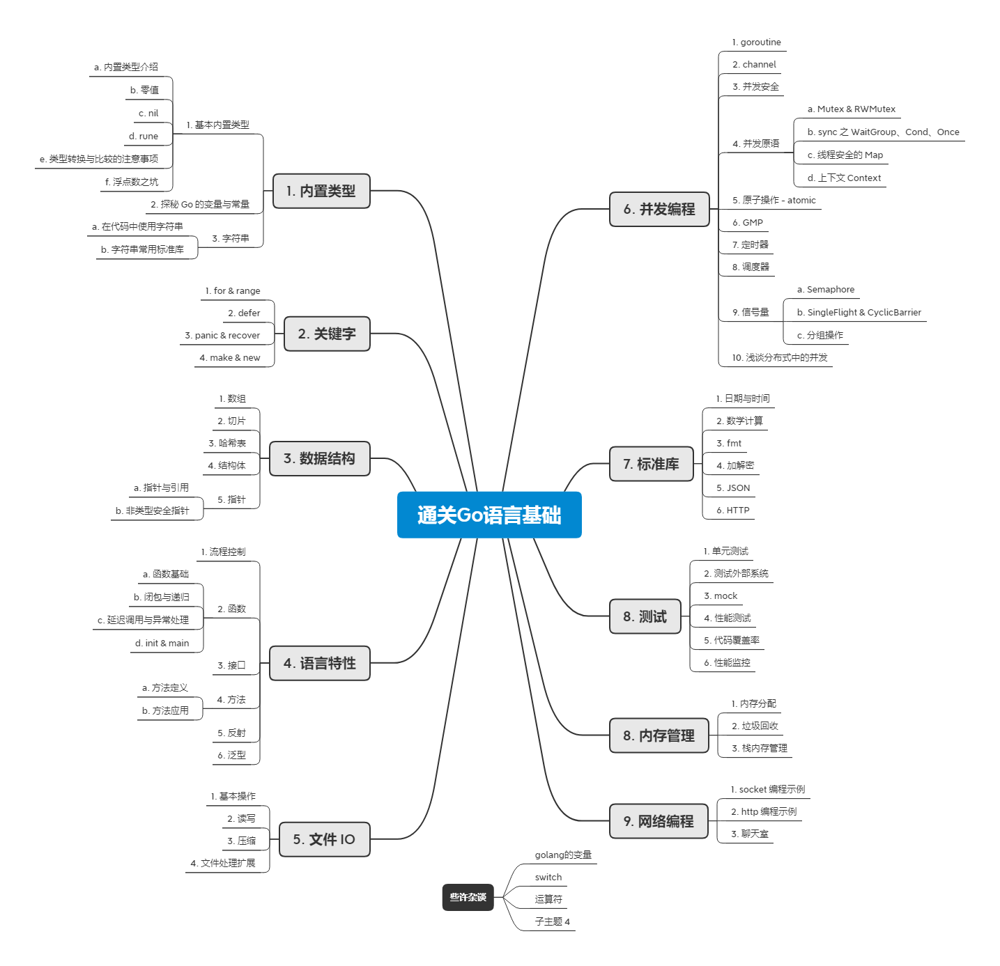

# GoNote
my golang note

由于笔者能力有限，如果错误请指正，感谢您的阅读。

## 通关 Go 语言基础

简介： 本系列是笔者在入门和上手 golang 之后，再回顾 golang 进行依次系统和深入学习，追求简明扼要的列出基本知识点，然后深挖 Go 基础知识点背后的底层逻辑。

笔者在学习过程中参阅了很多书籍，特别感谢以下几本书籍和它们的作者，为笔者学习 golang 提供宝贵的知识，也正因为如此，才有了本系列笔记：

- 雨痕 《Go 语言学习笔记》
- 左书祺《Go语言设计与实现》
- 李文周 https://www.liwenzhou.com/posts/Go/golang-menu/

## 催更作者

请备注 【github】

